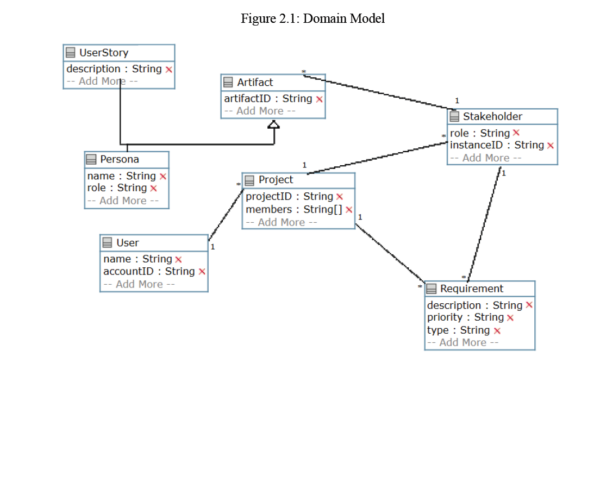
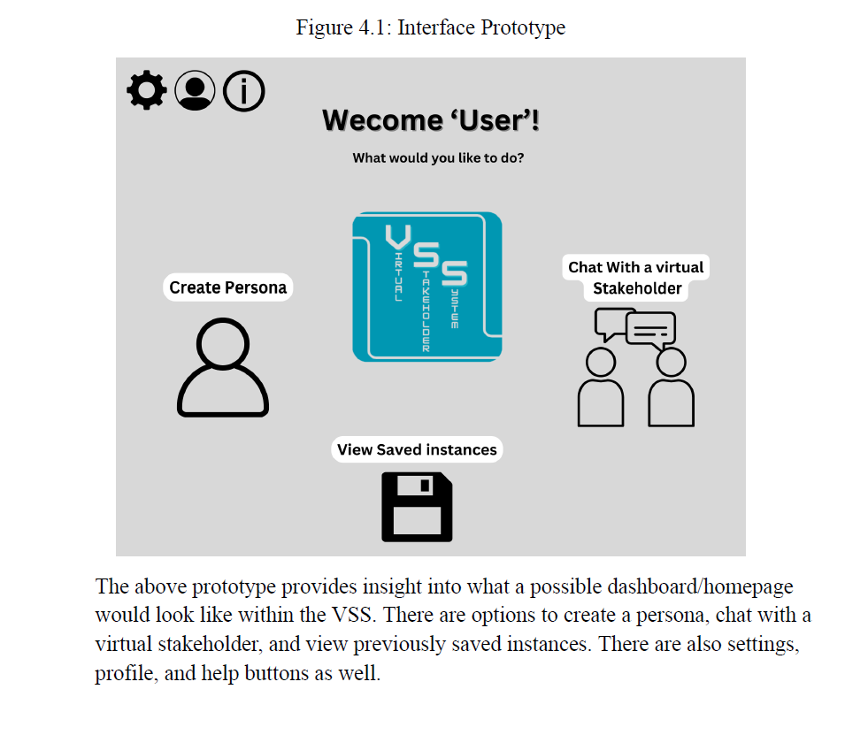
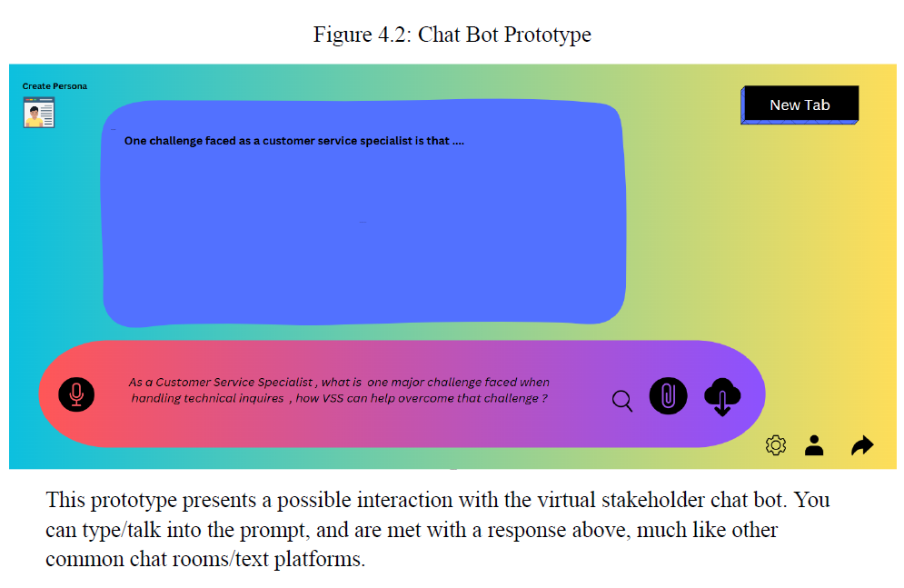
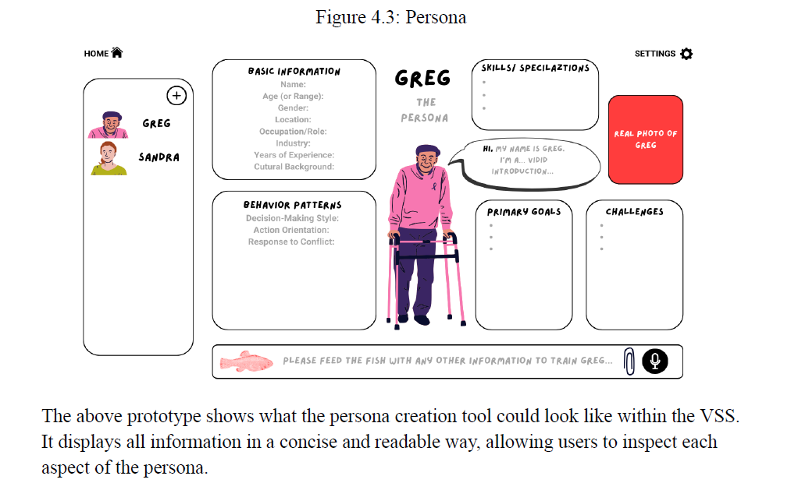

# software-requirements-engineering-project

Collaborative academic project exploring stakeholder analysis, requirements engineering, system modeling, and iterative software documentation.

---

# Project Overview

This project explored the design of a Virtual Stakeholder System (VSS), a conceptual platform intended to support stakeholder interaction and requirements analysis workflows.

Key focus areas included:
- user stories
- personas
- functional and non-functional requirements
- UML/system modeling
- interface prototyping
- traceability mapping
- iterative deliverables

---

# What I Learned

Through this project, I gained exposure to:
- software requirements engineering workflows
- stakeholder communication and analysis
- collaborative project documentation
- iterative software development processes
- system modeling concepts
- requirements traceability

I also learned the importance of teamwork, communication, and iterative improvement throughout the software development lifecycle.

---

# Team Collaboration

This project was completed collaboratively in a team environment with iterative improvements across multiple deliverables based on feedback, stakeholder interviews, and team discussions.

---

# Repository Structure

docs/ → project deliverables and documentation

diagrams/ → UML and system modeling visuals

prototypes/ → interface prototypes and concept designs

---

# System Design

## Domain Model

---

# Interface Prototypes

## Main Interface Prototype

## Chatbot Interaction Prototype

## Persona Prototype

---

# Note

This repository is intended as an academic engineering showcase focused on learning software requirements engineering and collaborative system design concepts.
